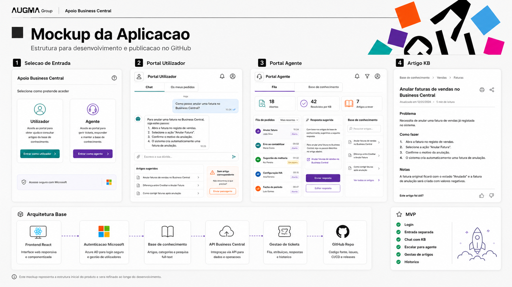

# Apoio Business Central

Aplicação web MVP para apoio interno à utilização do Microsoft Dynamics 365 Business Central.

O objetivo é criar um ponto único de entrada onde os utilizadores internos possam colocar dúvidas em linguagem natural, receber respostas baseadas numa knowledge base e, quando necessário, escalar o pedido para um agente de suporte.



## Funcionalidades incluídas no MVP

- Entrada separada para **Utilizador** e **Agente**
- Portal de Utilizador com:
  - chat de apoio
  - pesquisa simples em artigos da knowledge base
  - artigos sugeridos
  - escalamento para agente
  - histórico local de pedidos
- Portal de Agente com:
  - fila de pedidos
  - KPIs
  - resposta sugerida
  - consulta rápida da knowledge base
  - fecho de pedidos
- Base de Conhecimento com:
  - lista de artigos
  - detalhe por artigo
  - estrutura por problema, passos e notas
- Dados mockados para validação funcional sem backend

## Stack

- React
- TypeScript
- Vite
- CSS
- Lucide React

## Como executar localmente

```bash
npm install
npm run dev
```

Depois abrir o URL apresentado no terminal, normalmente:

```bash
http://localhost:5173
```

## Como publicar no GitHub

```bash
git init
git add .
git commit -m "Initial MVP Apoio Business Central"
git branch -M main
git remote add origin https://github.com/<utilizador>/<repositorio>.git
git push -u origin main
```

## Estrutura do projeto

```text
src/
├─ components/
├─ data/
├─ pages/
├─ types/
├─ utils/
├─ App.tsx
├─ main.tsx
└─ styles.css
```


## Knowledge Base importada

Este projeto já inclui a knowledge base enviada em Markdown:

```text
content/knowledge-base/Base_Conhecimento_BC_final_completo.md
```

A KB foi convertida automaticamente para:

```text
src/data/articles.ts
```

Total de artigos importados: **72**

Cada artigo inclui:

- código
- título
- categoria
- disponibilidade para Utilizador
- disponibilidade para Agente
- problema
- diagnóstico
- causa provável
- solução
- como proceder
- validação final
- notas

### Como continuar a construir a KB

Opção simples para o MVP:

1. Atualizar o ficheiro Markdown em `content/knowledge-base/`.
2. Converter novamente para `src/data/articles.ts`.
3. Fazer commit no GitHub.

Opção recomendada numa fase seguinte:

1. Criar backend/API.
2. Guardar os artigos numa base de dados.
3. Criar formulário de criação/edição de artigos.
4. Adicionar workflow de validação antes de publicar artigos.
5. Indexar os artigos para pesquisa semântica.

## Roadmap recomendado

### Fase 1 — MVP visual e funcional

- Validar navegação
- Validar linguagem da interface
- Validar fluxo utilizador -> agente
- Ajustar taxonomia da KB

### Fase 2 — Autenticação

- Integrar Microsoft Entra ID
- Separar permissões por perfil:
  - utilizador
  - agente
  - administrador KB

### Fase 3 — Knowledge Base real

- Ligar a Confluence, SharePoint, ficheiros markdown ou base própria
- Indexação por área, processo, empresa e módulo BC
- Pesquisa semântica

### Fase 4 — IA controlada

- Respostas apenas com base em artigos aprovados
- Citação da fonte/artigo usado
- Escalamento automático quando não existe resposta confiável
- Criação de rascunhos de novos artigos a partir de tickets resolvidos

### Fase 5 — Business Central

- Integração com APIs do Business Central
- Contexto por empresa/ambiente
- Ligações diretas para documentos, clientes, fornecedores ou movimentos
- Validação de permissões antes de mostrar dados sensíveis

## Nota importante

Este projeto ainda não tem backend real nem autenticação Microsoft real. O objetivo é entregar uma base visual e funcional para validação interna e posterior evolução técnica.
